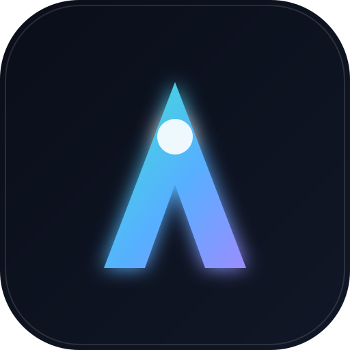

# Auralis — Health & Performance

> Il tuo corpo, finalmente compreso. Una companion app fitness & salute progettata per far sembrare Garmin Connect un reperto archeologico.

Auralis gira come **vera app desktop** (Electron, con `.dmg`/`.exe` da doppio clic) e come **Progressive Web App** installabile su **telefono e computer**: nessuno store, nessuna attesa. Sul desktop il backend Garmin è incluso nell'app; sul telefono la apri nel browser e la "Aggiungi alla schermata Home".

L'estetica è ispirata al **Liquid Glass di Apple**: superfici translucide e sfocate, bordi con riflessi speculari, uno sfondo "aurora" che respira lentamente e micro-animazioni a molla su ogni interazione.



## ✨ Cosa include

| Sezione | Funzionalità |
|---|---|
| **Oggi** | Anelli attività animati (passi · calorie · minuti intensi), Body Battery, stress, sonno, idratazione con quick-add, insight AI "Aura", segnali vitali |
| **Attività** | Lista con riepiloghi, dettaglio con traccia GPS stilizzata, frequenza cardiaca, altimetria, frazioni al km, zone FC, Training Effect |
| **Salute** | Frequenza cardiaca giornaliera, Body Battery, stress, SpO₂, frequenza respiratoria — con gauge radiali animati |
| **Sonno** | Punteggio, fasi (profondo/leggero/REM/sveglio), ipnogramma, HRV notturna, trend settimanale |
| **Allenamento** | Stato di forma, carico acuto/cronico, VO₂max, predittore tempi di gara, allenamenti consigliati |
| **Sfide** | Sfide community, badge, record personali, feed social con kudos |
| **Corpo** | Peso, BMI, massa grassa/muscolare, idratazione, trend nel tempo |
| **Profilo** | Account, dispositivo connesso, preferenze, export dati |

## 🎨 Design system — "Liquid Glass"

- Sfondo **aurora** vivo con blob in `drift` infinito + grana sottile
- Superfici `.glass` con `backdrop-filter: blur + saturate` e highlight speculare (`.glass-spec`)
- Anelli e gauge SVG animati con easing `[0.22, 1, 0.36, 1]`
- Transizioni di pagina con blur+fade, indicatori di navigazione con `layoutId` (morphing fluido)
- Palette: aqua · sky · violet · coral · amber · lime su fondo notte profonda

## 🔗 Accesso con account Garmin (dati reali)

Garmin **non offre un login OAuth pubblico** per i consumatori: l'unica API ufficiale (Garmin Health API) richiede una partnership aziendale approvata. Per collegare i tuoi dati reali, Auralis include un piccolo **backend** (`server/index.mjs`) che effettua il login a Garmin Connect con le tue credenziali — emulando il flusso SSO ufficiale tramite la libreria [`garmin-connect`](https://www.npmjs.com/package/garmin-connect).

- 🔐 **Le credenziali non vengono mai salvate**: servono solo per ottenere un token di sessione, tenuto in memoria sul backend e scartato dopo 12 ore.
- 🧪 È un metodo **non ufficiale** (zona grigia rispetto ai ToS Garmin), lo stesso usato da molte app di terze parti.
- 📲 La **verifica a due fattori (2FA)** non è ancora supportata dal login diretto.
- 🟢 Senza login l'app parte comunque in **modalità demo** con dati realistici.

Quando avvii con `npm run dev`, partono insieme la web app e il backend. Apri l'app, inserisci email e password Garmin nella schermata di accesso, e i tuoi dati (passi, frequenza cardiaca, Body Battery, stress, sonno, attività, peso, idratazione) vengono scaricati e mostrati. Puoi disconnetterti da **Profilo → Disconnetti account Garmin**.

## 🖥️ App desktop (consigliato)

Auralis è anche una **vera app desktop** (Electron): una finestra nativa, niente browser, con il backend Garmin incluso dentro l'app. Apri con doppio clic e basta.

```bash
npm install
npm run app            # avvia l'app in sviluppo (finestra nativa + hot reload)
npm run app:preview    # build + apre l'app come in produzione
npm run app:build:mac  # crea il .dmg per macOS  → cartella release/
npm run app:build:win  # crea l'installer .exe per Windows
npm run app:build      # pacchetto per il sistema corrente
```

Dopo `app:build:mac` trovi `Auralis-1.0.0.dmg` (e l'app) nella cartella **`release/`**: aprilo, trascina Auralis nelle Applicazioni e lancialo come qualsiasi app. Il server Garmin parte automaticamente dentro l'app — nessun terminale da tenere aperto.

> macOS richiede di compilare il `.dmg` **su un Mac**; l'installer Windows va creato su Windows (o con gli strumenti di cross-build di electron-builder).

## 🌐 Avvio come web app

```bash
npm run dev        # web (http://localhost:5173) + backend Garmin (http://localhost:8787)
npm run dev:web    # solo la web app (modalità demo)
npm run server     # solo il backend
npm run build      # build di produzione
npm run preview    # anteprima della build
```

> Il backend richiede accesso di rete a `sso.garmin.com` e `connect.garmin.com`. Sul tuo computer funziona; in ambienti con egress di rete ristretto il login Garmin potrebbe essere bloccato (l'app resta usabile in demo).

### Installare sul telefono / computer
1. Apri l'app nel browser (Safari su iOS, Chrome su Android/desktop)
2. **iOS**: Condividi → *Aggiungi alla schermata Home*
3. **Android/Desktop**: menu → *Installa app* / icona di installazione nella barra indirizzi

## 🛠️ Stack

- **React 18** + **TypeScript** + **Vite**
- **Framer Motion** — animazioni e gesture
- **Recharts** — grafici
- **Tailwind CSS** — styling + utility glass custom
- **vite-plugin-pwa** — installabilità & offline
- **lucide-react** — icone

## 📊 Dati

L'app gira su un dataset dimostrativo realistico (`src/data/mock.ts`) che riproduce le metriche di un dispositivo reale. La struttura è pronta per essere collegata a un backend o alle API di un wearable.

---

*Auralis v1.0 — progettato con cura, animato col vetro liquido.*
